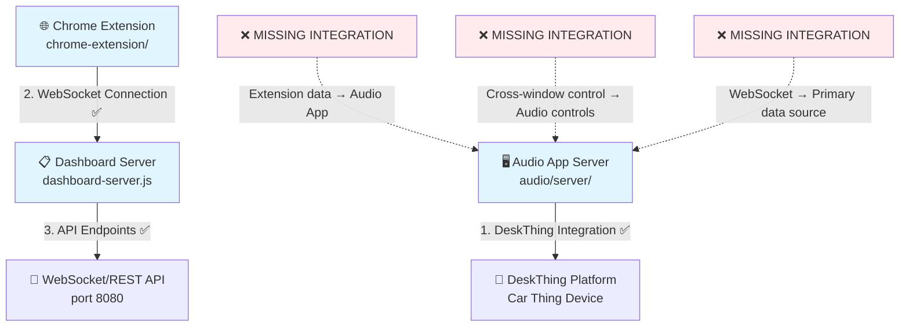
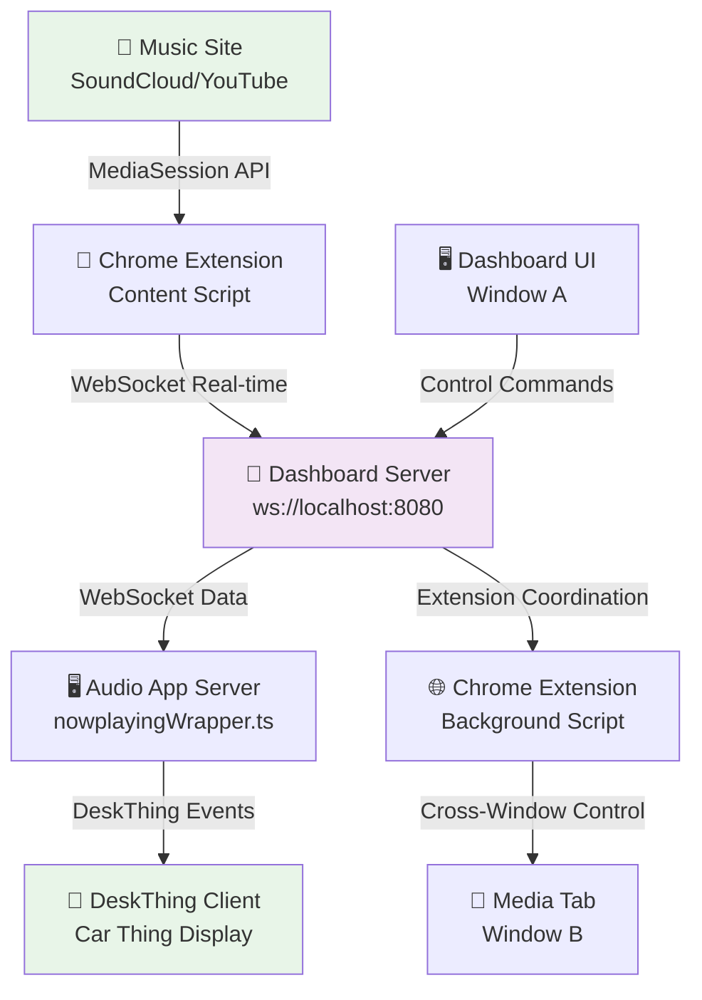

# DeskThing Audio App Architecture - Implementation Status

## 🎯 **System Overview**

The DeskThing Audio App implements a **Chrome Extension + WebSocket Integration** system designed to solve MediaSession API cross-window limitations. The architecture consists of three main components that currently work independently but need integration.

## 🏗️ **Current System Architecture**



## 🔧 **Core Components Status**

### 1. **Audio App Server** (`audio/server/`) ✅ **WORKING**
- **Purpose**: DeskThing platform integration and media event handling
- **Status**: ✅ Complete DeskThing integration, basic media detection via `node-nowplaying`
- **Key Features**:
  - MediaStore handles DeskThing audio events properly
  - nowplayingWrapper designed for WebSocket but integration incomplete
  - Image handling and caching working

### 2. **Dashboard Server** (`dashboard-server.js`) ✅ **WORKING**
- **Purpose**: WebSocket + REST API server for real-time communication
- **Status**: ✅ Complete Express + WebSocket server with full API
- **Key Features**:
  - Real-time WebSocket communication on ws://localhost:8080
  - Comprehensive REST API endpoints
  - Chrome extension coordination endpoints (designed but not used by audio app)

### 3. **Chrome Extension** (`chrome-extension/`) ✅ **WORKING STANDALONE**
- **Purpose**: MediaSession detection and cross-window coordination
- **Status**: ✅ Complete extension with cross-window capabilities, but not integrated with audio app
- **Key Features**:
  - background.js: Cross-window tab discovery and message relay
  - content.js: MediaSession monitoring and WebSocket connection
  - popup.js: Working media controls and status display

## 📡 **API Endpoints Status**

### **Core Media Control** ✅ **WORKING**
- `POST /api/media/control` - ✅ Basic media control commands working
- `GET /api/media/status` - ✅ Current media status with basic data
- `GET /api/media/detect` - ✅ Detect active media sessions

### **Chrome Extension Coordination** ✅ **DESIGNED BUT NOT USED**
- `POST /api/extension/control` - ✅ Extension command queuing (exists but audio app doesn't use)
- `GET /api/extension/poll` - ✅ Content script command polling (implemented but unused)
- `POST /api/extension/result` - ✅ Command result reporting (ready but not integrated)

### **WebSocket Communication** ✅ **INFRASTRUCTURE READY**
- `ws://localhost:8080` - ✅ WebSocket server accepting connections
- Real-time media updates - ✅ Server handles messages (audio app integration incomplete)
- Extension registration - ✅ Chrome extension connects successfully

## 🎵 **Supported Media Sites Status**

### **Chrome Extension Detection** ✅ **WORKING**
- **SoundCloud**: ✅ MediaSession monitoring working
- **YouTube**: ✅ MediaSession detection implemented
- **Spotify Web**: ✅ MediaSession support ready
- **YouTube Music**: ✅ MediaSession integration ready

### **Audio App Integration** ❌ **INCOMPLETE**
- **Primary Source**: ❌ Still using `node-nowplaying` instead of extension data
- **Enhanced Metadata**: ❌ AppleScript syntax errors prevent advanced detection
- **Real-time Updates**: ❌ Polling instead of WebSocket data consumption

## 🔄 **Control Methods Status**

### **1. Traditional node-nowplaying** ✅ **WORKING**
- ✅ **Pros**: Reliable basic detection, established integration
- ✅ **Current**: Audio app primary method
- ❌ **Limitations**: Limited metadata, no cross-window support

### **2. Chrome Extension Cross-Window** ✅ **DESIGNED, ❌ NOT INTEGRATED**
- ✅ **Pros**: Cross-window capability, MediaSession API access, real-time updates
- ✅ **Infrastructure**: Complete extension with coordination code
- ❌ **Integration Gap**: Audio app doesn't use extension control system

### **3. Enhanced MediaSession AppleScript** ❌ **BROKEN**
- ❌ **Current Issue**: AppleScript syntax errors prevent execution
- ❌ **Impact**: No advanced metadata (duration, position, artwork)
- ❌ **Status**: Quote escaping problems in media-session-detector.js

## 🐛 **Current Issues & Integration Gaps**

### **WebSocket Pipeline Integration** ❌ **INCOMPLETE**
```javascript
// ✅ WORKING: Extension connects to WebSocket
const ws = new WebSocket('ws://localhost:8080');

// ❌ MISSING: Audio app doesn't properly consume WebSocket data
// nowplayingWrapper.ts connects but integration incomplete
// Audio app still uses node-nowplaying as primary source
```

### **Cross-Window Control Integration** ❌ **INCOMPLETE**
```javascript
// ✅ WORKING: Extension background script coordination
chrome.tabs.query() // ✅ Find media tabs across windows
chrome.tabs.sendMessage() // ✅ Send commands to any tab

// ❌ MISSING: Audio app doesn't use cross-window control
// /api/extension/control exists but not connected to audio controls
```

### **Enhanced Detection** ❌ **BROKEN**
```javascript
// ❌ BROKEN: AppleScript syntax errors
// 907:907: syntax error: Expected """ but found end of script. (-2741)
// Quote escaping issues prevent JavaScript injection
```

## ⚡ **Performance Characteristics**

### **Current Performance** ⚠️ **MIXED**
- **Audio App**: ✅ Stable DeskThing integration, basic polling detection
- **Dashboard Server**: ✅ Sub-100ms WebSocket updates when working
- **Chrome Extension**: ✅ Real-time MediaSession monitoring, instant popup controls
- **Integration**: ❌ Components work independently, no unified performance

### **Target Performance** 📋 **DESIGNED**
- **Latency**: <200ms end-to-end control response time
- **Real-time Updates**: WebSocket streaming vs polling
- **Cross-Window**: Dashboard controls from any window
- **Enhanced Metadata**: Duration, position, artwork from MediaSession

## 🔒 **Security & Compatibility**

### **Chrome Extension Security** ✅ **COMPLIANT**
- ✅ **CSP Compliance**: All Content Security Policy violations resolved
- ✅ **Permissions**: Minimal required permissions for cross-window functionality
- ✅ **Content Scripts**: Secure MediaSession monitoring without security issues

### **WebSocket Security** ✅ **IMPLEMENTED**
- ✅ **CORS Headers**: Proper cross-origin handling
- ✅ **Connection Management**: Robust reconnection and error handling
- ✅ **Data Validation**: Message format validation and error recovery

## 🎯 **Integration Requirements**

### **Priority 1: WebSocket Pipeline Connection**
- **Fix nowplayingWrapper.ts**: Make audio app properly consume Chrome extension WebSocket data
- **Message Format Alignment**: Ensure extension sends data in format audio app expects
- **Primary Source Switch**: Use WebSocket data instead of node-nowplaying

### **Priority 2: Cross-Window Control Integration**
- **Connect Extension Control**: Make `/api/extension/control` trigger actual audio app controls
- **Background Script Connection**: Route extension coordination to audio app
- **Multi-Window Testing**: Dashboard Window A controls media Window B

### **Priority 3: Enhanced Detection Fixes**
- **AppleScript Syntax Repair**: Fix quote escaping in media-session-detector.js
- **MediaSession Enhancement**: Enable duration, position, artwork detection
- **Multi-Platform Support**: Complete YouTube, Spotify Web, Apple Music integration

## 🏆 **Target Architecture (After Integration)**

### **Integrated Data Flow** 📋 **TARGET**


### **Integration Success Metrics** 📋 **TARGET**
- [ ] **Cross-Window Control Success Rate** - >95% command execution across windows
- [ ] **Latency Performance** - <200ms end-to-end control response time
- [ ] **WebSocket Integration** - Audio app uses extension data as primary source
- [ ] **Enhanced Metadata** - Duration, position, artwork working reliably

## 💡 **Key Architectural Insights**

### **Foundation Quality** ✅ **EXCELLENT**
- **Solid Infrastructure**: All major components exist and work independently
- **Chrome Extension Approach**: Cross-window coordination implemented correctly
- **WebSocket Architecture**: Server handles real-time communication properly
- **DeskThing Integration**: Audio app connects to platform correctly

### **Integration Challenge** ⚠️ **SOLVABLE**
- **Not Rebuilding**: All components work, just need connections
- **Clear Interfaces**: APIs and protocols defined and implemented
- **Systematic Approach**: Step-by-step integration path identified
- **High Success Probability**: No fundamental architectural changes needed

---

**Last Updated:** January 2025 - Architecture status corrected to reflect actual implementation vs design  
**Key Insight:** Excellent architectural foundation with clear integration path to completion 